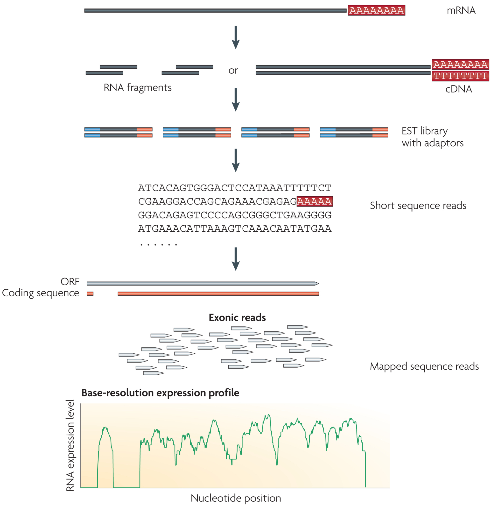

<style type="text/css">
#TOC {
  text-align: left;
}
</style>

<style>
body {
text-align: justify}
</style>

```{r, include=FALSE, message=FALSE}
library(knitr)
library(kableExtra)

```

# Introduction

This advanced technology report describes a [limma-based approach](https://bioconductor.org/packages/release/bioc/html/limma.html) to analyze RNA sequencing data and extract gene-level statistics to perform gene set analysis using the package [PIANO](https://bioconductor.org/packages/release/bioc/html/piano.html) (**P**latform for **i**ntegrative **an**alysis of **o**mics data). The report is mainly focused on the analysis performed after generating a gene-count file with the [nf-core RNA-seq pipeline](https://github.com/nf-core/rnaseq). How to map the reads to a reference genome will be briefly discussed from a theoretical point of view, but no code will be shown or discussed. After a brief introduction on RNA-sequencing principles, the code used to perform the analysis will be described and explained step by step. The procedure and results are based on *Y. lipolitica* but can be easily adjusted to different organisms as well. All the code is available [in this GitHub directory](https://github.com/Simoza/RNA-seq_TechnologyReport).

# RNA-sequencing principles

RNA-sequencing is a technique that aims to sequence and quantify the transcriptome of a cell. Given a specific physiological condition, the transcriptome is the complete set of transcripts and their quantity in a cell. Understanding the transcriptome is essential to interpret the functional elements of the genome, to reveal the molecular processes that are taking place in a cell, and to infer which regulation mechanisms underline specific phenotypic responses.

In general, a population of RNA (total population or mRNA-enriched) is converted to a library of cDNA fragments with adapters attached to one or both ends (Figure 1). Each molecule is then sequenced to obtain short sequences from one end in case of single-end sequencing or both ends in case of pair-end sequencing. The reads usually have a length between 30 and 400 bp, depending on the sequencing technology used. Following sequencing, the reads are trimmed to remove nucleotides with low quality scores, and then aligned to a reference genome to quantify gene counts. The output of this procedure is a file for which each row represents a gene name, and each column a sample; the intersections are the gene counts. 

```{r DiagramRNA, echo= FALSE, label = "DiagramRNA", fig.cap= "**Figure 1**: RNAs are first fragmented and then converted into a library of cDNA fragments. Sequencing adaptors are subsequently ligated to each cDNA fragment. Through high-throughput sequencing technologies a short sequencing is obtained from each cDNA. The resulting sequence reads are aligned with the reference genome or transcriptome to generate a base-resolution expression profile for each gene. Adapted from [Wang, Zhong et al. (2009)](https://www.ncbi.nlm.nih.gov/pmc/articles/PMC2949280/)"}



```

## Isolation of RNA

The first step in RNA-sequencing is the isolation of RNA. In our experiments we extracted RNA with the [RNeasy kit from Qiagen](https://www.qiagen.com/us/products/discovery-and-translational-research/dna-rna-purification/rna-purification/total-rna/rneasy-kits/). Biological samples are first lysed and homogenized in the presence of a highly denaturing guanidine-thiocyanate–containing buffer. This buffer inactivates RNases and ensures purification of intact RNA. After adding ethanol to provide appropriate binding conditions, the sample is loaded on a silica-based column. The total RNA binds to the matrix of the column, and few washing steps ensure removal of contaminants. Finally, RNA can be eluted in milliQ-water.

After RNA extraction, the quality of the extracted RNA needs to be assessed. The quality of RNA is typically measured through a [Bioanalyzer (Agilent Technologies)](https://www.agilent.com/en/product/automated-electrophoresis/bioanalyzer-systems/bioanalyzer-instrument/2100-bioanalyzer-instrument-228250), an automated electrophoresis system that can monitor and estimate the RNA quality of the samples. The Bioanalyzer calculates a RIN value (RNA Integrity Number), a number between 1 and 10, where 10 represent high quality samples showing the least degradation. The RIN value estimates sample integrity and is calculated based on the ratios of 28S and 18S ribosomal bands. Since the RIN values are based on the abundance of 28S and 18S of mammalian cells, cells with different ribosomal ratios may generate low RIN numbers that do not necessarily correlate with low sample quality. Usually for yeasts such as *Y. lipolytica* and *S. cerevisiae* RIN values between 7-8 produce libraries that can be successfully sequenced. Low-quality RNA should not be sequenced since RNA degradation affects the sequencing results due to uneven gene coverage and 3′–5′ transcript bias, and would lead to erroneous quantification and thus erroneous biological interpretation of the data.

## Library preparation and sequencing

Before constructing a library for the sequencing, it is necessary to enrich or deplete the total RNA sample from particular RNA species. The total RNA pool includes ribosomal RNA (rRNA), precursor messenger RNA (pre-mRNA), mRNA, and various classes of non-coding RNA such as tRNA, miRNA, small RNA, long non coding RNA, etc. Since rRNA is the most abundant RNA specie it it necessary to deplete the rRNA to avoid consuming the bulk of the sequencing reads, limiting the detection of other less-abundant RNAs. Depending on the goal of the analysis and depending on which class of RNA we want to sequence, many enrichment (or depletion) protocols have been designed ([Kukurba, K. R., & Montgomery, S. B. (2015)](https://www.ncbi.nlm.nih.gov/pmc/articles/PMC4863231/)):

```{r EnrichmentMethods, echo=FALSE}
table1 <- read.csv2("../docs/tables/Table1.csv")
colnames(table1)[1] <- "Library design"
kable(table1) %>%
  kable_styling("striped")
rm("table1")

```

The most commonly used protocol to study the mRNA profile of the cell consists in poly-A enrichment. In this approach, the 3′ poly-A tail of mRNA molecules is targeted using poly-T oligos that are covalently attached to a given substrate such as magnetic beads. Following this enrichment step, the mRNA is fragmented and these fragments are copied into the first strand of cDNA using reverse transcriptase and random primers. After the first strand of cDNA is synthetised, dTTP are replaced with dUTP and the second strand of cDNA is synthetised. At this point, a single 'A' nucleotide is ligated to the 3' ends of the blunt fragments, creating overhangs. The adapter has a 'T' nucleotide in the 3' tail and it has a complementarity overhang to the fragment to which it needs to be ligated. The adapters ensure that the fragments that need to be sequenced attache to the sequencing flow cell.

The sequencing industry has been dominated by Illumina, which applies an ensemble-based (sequencing many identical copies of a DNA molecule) sequencing-by-synthesis approach. Using fluorescently labeled reversible-terminator nucleotides, DNA molecules are clonally amplified while immobilized on the surface of a glass flowcell. Currently, the [Illumina HiSeq platform](https://www.illumina.com/systems/sequencing-platforms.html) is the most commonly applied next-generation sequencing technology for RNA-Seq and has set the standard for NGS sequencing. The platform has two flow cells, each providing eight separate lanes for sequencing reactions to occur. 

## From sequencing to gene counts

There are many steps separating the RNA sequencing and the generation of the gene count file. These steps will be described briefly, but more literature and documentation can be found [here](https://github.com/nf-core/rnaseq) and [here](https://training.galaxyproject.org/training-material/topics/transcriptomics/tutorials/rna-seq-reads-to-counts/tutorial.html).

The analysis begins with the generation of the sequencing reads. For each sample the output  is a single FASTQ file if performing single-end sequencing, or two FASTQ files for double-end sequencing. A FASTQ file is a text-based file format for storing both a nucleotide sequence and its corresponding quality scores for the sequencing. After obtaining FASTQ files, the first step is performing quality control on the reads. During sequencing, errors might be introduced, such as incorrect nucleotides. Every base sequence gets a quality score from the sequencer and this information is present in the FASTQ file. At this step, the base quality of all samples should be checked. It is also necessary to check if the Illumina adapters have been  sequenced. To perform this step the [FastQC](https://www.bioinformatics.babraham.ac.uk/projects/fastqc/) or [MultiQC](https://github.com/ewels/MultiQC) packages can be used. In case adapters have been sequenced, it is necessary to trim the reads to remove the  adapter and to remove any low quality bases at the ends of the read. Sequences that will be too short ( usually < 20bp) will be discarded. This step can be performed with [Trim Galore](https://github.com/FelixKrueger/TrimGalore). 

<!-- fastQC works both for nucleotide sequence quality and to check for adapters, but I understand that you use fastQC only to check for adapters and it is a different step (maybe I am misunderstanding) -->

After these preprocessing steps, the reads can be aligned. For *Y. lipolytica* and *S. cerevisiae* reference genomes that can be used to map the reads are available. To perform the alignment [STAR](https://github.com/alexdobin/STAR) can be used. The alignment produces a set of BAM files, where each file contains the chromosomal location for every read that was mapped. The mapped reads can now be counted across genes by using a tool called [Salmon](https://github.com/COMBINE-lab/salmon) that quantifies the reads mapped to exons and produces the read count for each gene.

<!-- Normally, you get a BAM file first, and then these are converted to BAM files. It is my understanding that STAR can output directly into sorted BAM files. So, perhaps you could mention this  -->

# Differential gene expression analysis

<!-- Maybe you can describe your experiment a little bit, and what you are looking for -->

I will now describe all the steps required to perform differential gene expression analysis. Differential gene expression analysis consists in taking the normalized read count data and performing statistical analysis to discover quantitative changes in expression levels between experimental groups.

## Install the required packages

The first step is installing all the packages required to perform the analysis.

```{r, results='hide', message=FALSE, warning=FALSE}
# Install and load packages from bioconductor
if (!require("BiocManager", quietly = TRUE)) install.packages("BiocManager")
if (!require("edgeR", quietly = TRUE)) BiocManager::install("edgeR"); library(edgeR)
if (!require("limma", quietly = TRUE)) BiocManager::install("limma"); library(limma)
if (!require("piano", quietly = TRUE)) BiocManager::install("piano"); library(piano)
if (!require("EnhancedVolcano", quietly = TRUE)) BiocManager::install("EnhancedVolcano"); library(EnhancedVolcano)

#Install and load packages from CRAN
if (!require('tidyverse')) install.packages('tidyverse'); library('tidyverse')
if (!require('RColorBrewer')) install.packages('RColorBrewer'); library('RColorBrewer')
if (!require('ggpubr')) install.packages('ggpubr'); library('ggpubr')
if (!require('gplots')) install.packages('gplots'); library('gplots')
if (!require('gridExtra')) install.packages('gridExtra'); library('gridExtra')
if (!require('eulerr')) install.packages('eulerr'); library('eulerr')
if (!require('snowfall')) install.packages('snowfall'); library('snowfall')

```

## Preprocessing

In the pre-processing step we are going to load our data, filter genes with low reads, and normalize the gene counts. 

### Load the data

To perform differential gene expression analysis, we need a file containing the gene counts of our samples. The rows contain the gene name and each column corresponds to a sample. At the intersection the read counts of a specific gene for a specific sample are reported. 

```{r}
gene_counts <- read.csv2("../data/gene_counts.csv", row.names = 1 )

```

The count matrix looks like this:

```{r GeneCounts, echo=FALSE}
kable(gene_counts[316:326, 1:8]) %>%
  kable_styling("striped")

```

To perform downstream analysis and draw conclusions, sample-level information related to the experiment needs to be associated with the columns (samples) of the counts matrix. The metadata should include experimental variables that could have an effect on expression levels.

```{r}
metadata <- read.csv2('../data/metadata.csv', skip =0) #import metadata
cols <- c("Strain","NitrogenSource","CN_Ratio","DR") #columns to convert to factors
metadata[cols] <- lapply(metadata[cols], factor) #convert columns to factors
rm("cols") #remove cols variable from environment

```

The metadata look like this:
```{r metadata, echo=FALSE}
kable(metadata[1:10,1:5]) %>%
  kable_styling("striped")

```

Now that we have the gene_counts and the metadata, we can create a DGEList, the object we will use to perform the analysis. The DGEList function takes gene counts, gene names, a dataframe containing sample metadata, and a group as input arguments. The function will associate the first column of the gene_count matrix (so the first sample) with the first level of the samples argument, which contains the metadata of the samples. This means that the samples in the columns of gene_counts need to be in the same order as the samples in the metadata dataframe. Performing this step will associate the gene_counts information with all the experimental variables that are included in the metadata (in this example strain, dilution rate, nitrogen source, and C/N ratio) and will allow to easily subset for specific conditions. 

The output of the DGEList function is a list that includes three objects:

1. **Counts**: this is a numeric vector that contains the gene counts information,

2. **Samples**: this is a dataframe in which the metadata information are saved. When running the DGEList function, new column are also added to the dataframe. One column called "group" stores the information about experimental groups. In this case, the information about the experimental group can be piped into the function by specifying a "group" argument that is generated by pasting the experimental variables separated by an underscore. The DGEList function also calculates and stores the information of the library size, a number reporting the total counts (sequencing depth) for each library. This information is stored in the "lib.size" column. In the dataframe we also get a column called "norm.factors". Stored in this column is the information on the normalization factor to apply to normalize gene counts across libraries with different sizes. At the moment every normalization factor is 1 because we haven't calculated them yet.

3. **Genes**: a character vector storing the names of the genes.


```{r}
#Create DGEList and add the metadata of the samples
x <- DGEList(counts = gene_counts, 
             genes = rownames(gene_counts), 
             samples = metadata,
             group = paste(metadata$Strain,
                           metadata$NitrogenSource,
                           metadata$CN_Ratio,
                           metadata$DR,
                           sep = "_"))
```

### Filter low reads

Before performing differential gene expression analysis, we need to remove genes that have read counts that are too low to be retained in a statistical analysis. We need to perform this filtering step for several reasons:

* genes with low gene counts in all samples provide little evidence for differential expression;

* often samples contain many genes with very low gene counts or with gene counts equal to zero;

* testing for many differentially expressed genes simultaneously contributes to the multiple testing burden. 

The multiple testing burden arise when a statistical analysis involves multiple statistical tests. For each set of tests, a p-value is usually applied as cutoff between accepting or rejecting the null hypothesis. As the number of tests increases, it becomes more likely that the groups will differ for at least one feature by chance, since with a p value of 0.05 we expect a 5% probability of rejecting a null hypothesis. Scaling up the numbers, if we are performing 1000 comparisons to analyse differentially expressed genes, and each comparison is performed with a significance level at 0.05, the expected number of gene falsely detected genes as differentially expressed is 50. This would reduce the reliability of our analysis and conclusions. To prevent the multiple test burden, several methods have been developed, for example  the Bonferroni method, or  the Benjamini and Hochberg method. These methods aim to prevent the inflation of false positive rates that occurs with multiple statistical testings by adjusting the p-value ([Jafari, M., & Ansari-Pour, N. (2019)](https://www.ncbi.nlm.nih.gov/pmc/articles/PMC6099145/)).

To remove genes with low reads, it is necessary to perform a filtering step before continuing with the analysis. The filtering step cannot be performed on raw read counts since raw read counts do not account for different library sizes. There are several ways to account for library sizes, some of which also account for gene length, since longer genes have higher probability of having more reads mapped to them. Even though the methods that account for both library size and gene length are more accurate, we will use the log<sub>2</sub>-CPM (log<sub>2</sub> count per million) values that only account for library size, mainly for two reasons. First, since log<sub>2</sub>-CPM only account for library size, we don't need to feed information about the length of each gene in the dataset; the counts matrix alone is sufficient to calculate log<sub>2</sub>-CPM. Second, since the gene lengths remain constant among samples because we are comparing the same organism, any observed differences are a result of changes in condition rather than changes in gene length.

Therefore, we first convert raw gene counts to log<sub>2</sub>-CPM to account for differences in sequencing depth between samples, and then we perform a filtering step with the function "filterByExpr". Quoting the [function documentation](https://rdrr.io/bioc/edgeR/man/filterByExpr.html), "the filterByExpr function keeps genes that have worthwhile counts in a minimum number of samples". In our case the minimum number of samples is at least three samples since the smallest group size is three. The function accesses the group factor contained in the DGEList in order to compute the minimum group size, but the filtering is performed independently of which sample belongs to which group so that no bias is introduced. After determining the minimum group size, the function calculates the median library size and uses that value to determine a CPM.Cutoff. The CPM.Cutoff is defined as the ratio between the min.count (default at 10) adjusted to 10<sup>6</sup> to convert to count-per-million, and the median library size. Calculated this parameter, the function computes the rowsum of the counts of each gene and only keeps those genes whose sum is above the CPM.Cutoff in at least the min sample size (in our case in at least three samples). 

<!-- maybe you can add a figure here to be clear about how you filter out low counts  -->

```{r, warning=FALSE,fig.width=10, fig.height=5}
lcpm <- cpm(x, log = T) #Normalize for library size (logCPM)

#Plot raw logCPM reads before the filtering step
par(mfrow = c(1, 2))
nsamples <- ncol(x)
col <- brewer.pal(nsamples, "Paired")
plot(density(lcpm[, 1]),col = col[1],ylim = c(0, 0.6), las = 2, 
     main = "A. Raw data",
     xlab = expression("log"[2]*"CPM"))
  abline(lty = 3)
    for (i in 2:nsamples) {
        den <- density(lcpm[, i])
        lines(den$x, den$y, col = col[i])
          }

#Filter with filterByExpr function
keep <- filterByExpr(x, group = x$samples$group,
                     lib.size = x$samples$lib.size)
x_Filtered <- x[keep, keep.lib.sizes = FALSE]

#Normalize to log CPM after filtering out low counts
lcpm_x_Filtered <- cpm(x_Filtered, log = T)

#Plot logCPM of the filtered dataset
plot(density(lcpm_x_Filtered[, 1]),col = col[1],ylim = c(0, 0.6), las = 2,
     main = "B.filterByExpr",
     xlab = expression("log"[2]*"CPM"))
  abline(lty = 3)
    for (i in 2:nsamples) {
      den <- density(lcpm_x_Filtered[, i])
      lines(den$x, den$y, col = col[i])
        }

```

Number of genes before the filtering step: `r dim(x)[1]` 
\
Number of genes before after filtering step: `r dim(x_Filtered)[1]` 
\

```{r, echo=FALSE}
rm(list=ls()[!(ls() %in% c("gene_counts", "x_Filtered", "lcpm_x_Filtered"))]) #clean the working environment

```


### Normalize gene counts
Now it is necessary to normalize the gene counts before making comparisons of expression between samples. The gene counts are proportional to the expression levels of RNA, but are also influenced by other factors such as sequencing depth, gene length, and RNA composition. One approach to correct for these factors is with TMM normalization (*T*rimmed *M*ean of *M*-values). TMM normalization is a between-sample normalization method: the main goal is to account for library size variation between samples of interest, accounting for the fact that some extremely differentially expressed genes would impact negatively the normalization procedure. To correct for this TMM assumes that most of the genes are not differentially expressed between samples. Therefore, the normalization is performed after calculating a trimmed mean, i.e. the average after removing the upper and lower x% of the data [Robinson, M.D., Oshlack, A. (2010)](https://genomebiology.biomedcentral.com/articles/10.1186/gb-2010-11-3-r25). The goal of the TMM normalization is to perform comparisons between the same genes in different samples. Since same genes in different samples are assumed to have the same length, this normalization method does not take into account gene length. 


<!-- are the boxplots here necesary ? I saw you change the visibility of the outline. -->


```{r, fig.show='hide'}

x_Filtered_TMM <- calcNormFactors(x_Filtered, method = "TMM") #TMM normalization (trimmed mean of M-values)

#boxplot to check effect normalization
lcpm_x_Filtered_TMM <- cpm(x_Filtered_TMM, log = TRUE) #calculate lcpm normalized data
par(mfrow=c(1,2), mar = c(6,2,2,2))
boxplot(lcpm_x_Filtered, las= 3, outline = TRUE, main = "Not normalized", ylab = expression("log"[2]*"CPM"))
boxplot(lcpm_x_Filtered_TMM, las = 3, outline = TRUE, main = "Normalized", ylab = expression("log"[2]*"CPM"))

```

We can check the effect of the normalization in a boxplot:

```{r fig.width=10, fig.height=4, echo=FALSE}
par(mfrow=c(1,2), mar = c(6,2,2,2))
boxplot(lcpm_x_Filtered, las= 3, outline = FALSE, main = "Not normalized", ylab = expression("log"[2]*"CPM"))
boxplot(lcpm_x_Filtered_TMM, las = 3, outline = FALSE, main = "Normalized", ylab = expression("log"[2]*"CPM"))

```

## Exploratory analysis
To investigate samples similarities and dissimilarities, it is important to perform exploratory analysis with unsupervised methods such as multi-dimensional scaling (MDS) plot, or principal component analysis (PCA). Generally speaking, these methods aim to reduce the dimensionality of large datasets by identifying variables that maximize the variance between samples. Reducing the dataset dimensionality allows us to check how samples cluster based on the different experimental variables (in our case C/N ratio, dilution rate, strain, and nitrogen source). Ideally, biological replicates cluster close to each other. Any replicate straying far from its group can be identified and followed up for sources of error. MDS or PCA constitute therefore a key step in the understanding of complex biological systems, by indicating potential problems with the data, but also for generating new hypotheses. 

Such exploratory analysis can be performed in limma using the plotMDS function. The first dimension represents the leading-fold-change that best separates samples and explains the largest proportion of variation in the data. The subsequent dimension have a smaller effect on sample separation. Our experimental design involves multiple factors, and it is recommended that samples are examined over each factor. If samples cluster by a given factor, it suggests that the factor contributes to expression differences and is worth including that factor in further downstream analysis. On the other hand, factors that show little or no effect may be left out of downstream analysis, unless showing that few differences exist is part of the goal. In our case, whilst all samples cluster by replicates, the largest transcriptional difference is observed between strain JFYL007 and OKYL029 in C/N 116 and DR 0.1 (panel A). For this reason, the "strain" variable will be further analyzed. On the other hand, we can see from panel B that the factor "nitrogen source" is not separating our samples. 

```{r, warning=FALSE, fig.width=10, fig.height=10}
par(mfrow = c(2, 2)) #set graphics of plot
panels <- c("A. ", "B. ", "C. ", "D. ") #set the panel letters

#MDS plot for all the samples, colored by different conditions
for (i in (5:8)) { #from 5 to 8 because or factors are in column 5 to 8
    col.group <- x_Filtered_TMM$samples[[i]] #define levels of the factor
    levels(col.group) <- brewer.pal(nlevels(col.group), "Set1") #assign a color to each factor level
    col.group <- as.character(col.group) #assign color to each factor based on the level 
    plotMDS(lcpm_x_Filtered_TMM, labels = x_Filtered_TMM$samples[[i]] ,col = col.group) #generate MDS plot
    title(main = paste0(panels[i-4], #title of the plot. "i-4" to match i value with panel letter position
                        "All Samples by ",
                        colnames(x_Filtered_TMM$samples[i]))) #paste factor value name
    
}
          
```

## Differential gene expression analysis

From the MDS plot, we see that the largest difference is between strains in C/N 116 and DR 0.1. Therefore I decided to restrict the analysis to C/N ratio 116, DR 0.1, and ammonium sulphate as nitrogen source, and compare the fat-free JFYL007 strain and the obese OKYL049 strain with the wild-type OKYL029. Specifically we expect a bigger difference between JFYL007 and OKYL029 than between OKYL049 and OKYL029. 

### Subset

Subset the data:

```{r subset}
Subset <- x_Filtered_TMM[,which(x_Filtered_TMM$samples$CN_Ratio == "116" &
                                  x_Filtered_TMM$samples$NitrogenSource == "Ammonium Sulphate" &
                                  x_Filtered_TMM$samples$DR == "0.1")]

```

### Create design and contrast matrices

To find relationships that are of biological interest, appropriate statistical models need to be applied to the data. Differential expression analysis through limma uses linear models to determine the size and direction of the changes in gene expression. The modelling process through limma requires the use of a design matrix that defines the experiment structure and variables. After sub-setting the data, I use only the "Strain" variable to create a design matrix, since I am only interested in the effect of this factor. I also decided to use a means model (~ 0 + group) instead of a mean-reference model. As documented by [Law, C.W. et al. (2020)](https://f1000research.com/articles/9-1444/v1) the two models are equivalent for categorical variables (e.g. cell-type).

```{r}
#Create model matrix
strain <- Subset$samples$Strain
design.matrix <- model.matrix(~ 0 + strain, data = Subset) #define design matrix
rownames(design.matrix) <- rownames(Subset$samples)
colnames(design.matrix) <- gsub("strain", "", colnames(design.matrix))

```

The design matrix looks like this: 

```{r design matrix, echo=FALSE}
kable(design.matrix[1:9,1:3]) %>%
  kable_styling(bootstrap_options = "striped", 
                full_width = F, 
                position = "left")

```

Now we need to create a contrast matrix, that will be later used to specify which comparisons between group levels are to be extracted from the model. To build a constrast matrix we can use the *makeContrasts* function. Note that the second factor in the contrast matrix, in our case OKYL029, will be the reference. This means that a gene will be upregulated/downregulated in JFYL007 (or OKYL049) compared to OKYL029. 

```{r}
#Create contrast matrix
contrast.matrix <- makeContrasts(
   JFYL007vsOKYL029 = JFYL007 - OKYL029,
   OKYL049vsOKYL029 = OKYL049 - OKYL029,
   levels = colnames(design.matrix))

```

The contrast matrix looks like this: 

```{r contrast matrix, echo=FALSE}
kable(contrast.matrix[1:3,1:2]) %>%
  kable_styling(bootstrap_options = "striped", 
                full_width = F, 
                position = "left")

```

### Voom transformation
Limma works with voom-transformed data, so before fitting a model to the data we need to perform a voom transformation.

A voom transformation consists of the following steps:

1. Counts are transformed to log<sub>2</sub>-CPM, where the “per million reads” is defined based on the normalization factors that were calculated with the *calcNormFactors* function.

2. A linear model is fitted to the log<sub>2</sub>-CPM for each gene (gene-wise linear model fitting). The model borrows information from the design matrix and takes into account experimental design, experimental conditions, and replicates. 

3. When fitting the model, a standard deviation of the residuals for each gene is calculated. The residual is the difference between the observed value and the estimated value (for example, the mean).

4. A robust trend is then fitted to the residual standard deviations as a function of the average log<sub>2</sub>-CPM for each gene (red line in the voom-plot). The standard deviation trend is then used to calculate weights for each observation. Typically, the “voom-plot” shows a decreasing trend between the means and variances. Each observation with its log<sub>2</sub>-CPM values and associated weights is the input into limma’s differential expression pipeline.

You can find more details on how voom works [here](https://genomebiology.biomedcentral.com/articles/10.1186/gb-2014-15-2-r29).

```{r}
#perform voom transformation
v <- voom(Subset, 
          design.matrix,
          plot = TRUE) 

```

### Fit the model

Linear modelling in limma is carried out using the *lmFit* and *contrasts.fit* functions. These functions were originally written for application to microarrays, but after performing a voom transformation they can be used for RNA-seq data. 

* The *lmFit* function fits a linear model using weighted least squares for each gene. Weighted least squares is a generalization of ordinary least squares in which the variance of observations, that was estimated by the voom transformation, is incorporated into the regression. 

* The *contrasts.fit* function allows us to extract the fold-change between each gene in the groups specified by the contrast.matrix. 

```{r}
vfit <- lmFit(v, 
              design.matrix)

vfit <- contrasts.fit(vfit, 
                      contrasts = contrast.matrix) 

```

Next, [empirical Bayes moderation](https://pubmed.ncbi.nlm.nih.gov/16646809/) is carried out by borrowing information across all genes to obtain more precise estimates of gene-wise variability. The [*eBayes* function](https://rdrr.io/bioc/limma/man/ebayes.html) "takes the linear model as input and computes moderated t-statistics, moderated F-statistic, and log-odds of differential expression by empirical Bayes moderation of the standard errors towards a global value".

```{r}
vfit <- eBayes(vfit)

```

For a quick look at differential expression levels, the number of significantly up- and down-regulated genes can be summarized in a table. The default significance cutoff is based on adjusted p value and is set at 5%.

```{r, results='hide'}
summary(decideTests(vfit))

```

<!-- Here (summary) you show the data based on the adjusted p-value, but you use a different setting in the volcano plot, also here it seems to use zero as the fold change, but in the volcano there is a cutoff of 1 -->

```{r, echo = FALSE}
t <- (summary(decideTests(vfit)))
rownames(t) <- c("Downregulated", "Non significant", "Upregulated")
kable(t) %>%
  kable_styling(bootstrap_options = "striped", 
                full_width = F, 
                position = "left")

```

### Move the results in a list
After performing the eBayes moderation, for each comparison we obtain a table that looks like this:

```{r, echo = FALSE, warning=FALSE}
t <- topTreat(vfit, coef = 1, n = 12)
t <- t %>% dplyr::mutate_if(is.numeric, funs(as.character(signif(., 3))))

kable(t,
      row.names = F) %>%
  kable_styling("striped")

```

The columns contains:

* logFC: log<sub>2</sub> fold change

* AveExpr: average expression of the gene in all the samples, expressed in log<sub>2</sub>-CPM

* t: logFC divided by its standard error

* p.value: raw p-value derived from testing that logFC is different from 0

* adj.P.Val: Benjamini-Hochberg false discovery rate adjusted p-value

* B: log-odds that gene is DE (arguably less useful than the other columns)


Since usually multiple comparisons are performed, it is convenient to move all the results in a list, in which each element is the result of one comparison. This will also make possible to easily loop downstream analysis to all the comparisons, without writing additional code. From now on, all the code will automatically loop though all the comparisons and perform the analysis on each of them automatically, without having to modify or write additional code.

```{r }
#move the results of the comparisons in a list
comparison_list <- list()
for (i in 1:ncol(contrast.matrix)) {
   name = colnames(contrast.matrix)[i]
   tmp = topTreat(vfit, coef = i, n = Inf) 
   comparison_list[[name]] <- tmp
}

```

### Volcano plot

<!-- I think you should use the adjusted p-value instead of the p-value. -->

One way of visualizing the results of a differential gene expression analysis is through a volcano plot. A volcano plot is a type of scatter plot that is constructed by plotting the negative logarithm of the adjusted p-value on the y axis and the logarithm of the fold change on the x axis. This results in data points with significant p values towards the top of the plot, and with larger fold change differences to the far-left (negative fold change) or far-right (positive fold change) side of the plot. 

As you can see, the comparison JFYL007vs OKYL029 is shows more differentially expressed genes than the comparison OKYL049vsOKYL029. This is expected: in the PCA plot, the strain JFYL007 was clustering further away from OKYL029 than OKYL049. Furthermore, we already noticed this in the summary table in paragraph 3.4.4. 

<!-- why you use this chunk (27) and then repeat the code to plot (next chunk) just in another way ? If it is because you want to put it together you can change the configutation to {r, figures-side, fig.show="hold", out.width="50%" } -->

```{r, fig.show='hide', warning=FALSE}

for (i in 1:length(comparison_list)) {
        plot <- EnhancedVolcano(comparison_list[[i]],
                        lab = NA,
                        x = "logFC",
                        y = "P.Value",
                        pCutoff = 0.01,
                        FCcutoff = 1,
                        ylim = c(0,15),
                        title = paste0(names(comparison_list[i])),
                        subtitle = NULL,
                        xlim = c(-6,6),
                        )
  print(plot)
}


```

```{r, echo = FALSE, fig.width=14, fig.height=6, warning=FALSE}
        p1 <- EnhancedVolcano(comparison_list[[1]],
                        lab = NA,
                        x = "logFC",
                        y = "P.Value",
                        pCutoff = 0.01,
                        FCcutoff = 1,
                        ylim = c(0,15),
                        title = paste0(names(comparison_list[1])),
                        subtitle = NULL,
                        xlim = c(-6,6),
                        )
        p2 <- EnhancedVolcano(comparison_list[[2]],
                        lab = NA,
                        x = "logFC",
                        y = "P.Value",
                        pCutoff = 0.01,
                        FCcutoff = 1,
                        ylim = c(0,15),
                        title = paste0(names(comparison_list[2])),
                        subtitle = NULL,
                        xlim = c(-6,6),
                        )

grid.arrange(p1,p2, ncol=2, nrow=1)

```

# Gene set analysis
Extracting biological information from a volcano plot or from a result list with p-values and fold changes is quite challenging. Even comparisons between strains that are quite similar can yield hundreds of differentially expressed genes. Manually examining all the genes would be quite time consuming, and the interpretation would be highly dependent on the scientist's area of expertise. Furthermore, gene-wise analysis fail to give a global overview of which cell components, processes, functions, or pathways are differentially regulated between the cell-types being studied. 

To overcome these challenges, Gene Set Analysis (GSA) was developed. In a GSA, the gene sets are defined based on prior biological knowledge, such as published data about biochemical pathways, biological processes, cellular function, and cellular components. The goal of a GSA is to determines whether a defined gene set shows statistically significant differences between two condition in analysis. Several methods for performing gene set analysis have been developed, and each of them relies on different assumptions. In this workflow, I decided to perform GSA using the R package [PIANO](https://varemo.github.io/piano/), developed by our division. 

```{r, echo=FALSE}
rm(list=ls()[!(ls() %in% c("comparison_list"))]) #clean the working environment
```


## Load required functions

```{r, warning=FALSE}
source('../code/Functions/consGSA.R')
source('../code/Functions/consGSAplot.R')
source('../code/Functions/consGSAtable.R')

```

## Import gene set collection
To perform a GSA, it is necessary to have a gene set collection (GSC). A GSC looks like this:

```{r, echo = FALSE}
gene_sets <- read.csv2("../data/Gene_Set.csv")
colnames(gene_sets) <- c("Gene Sets", "Genes", "Level", "Term")

kable(gene_sets[51:61,],
      row.names = F) %>%
  kable_styling("striped")

```

In a GCS we can find four columns:

* Gene Sets: contains the id that uniquely identify a specific gene set.

* Genes: contains the gene names belonging to a specific gene set.

* Level: contains the levels to which a specific GO term is associated. It can have different levels such as biological process, molecular function, or cellular component.

* Term: contains the name of the GO term, which usually is quite descriptive.

For well studied organisms such as *S. cerevisiae*, public databases with the gene sets exists ([*Saccharomyces* genome database](https://www.yeastgenome.org)). For less studied organisms it might be necessary to generate a gene set collection. For *Y. lipolytica* there are no public GO dataset published, so we had to create our own. [OmicsBox](https://www.biobam.com/omicsbox) was used to generate gene sets by blasting *Y. lipolytica* exons against the [RefSeq non-redundant proteins database](https://www.ncbi.nlm.nih.gov/refseq/about/nonredundantproteins/) using BlastX algorithm.

After loading the file containing the GSC, we need to run the *loadGSC* function from the PIANO package to create a GSC object that will be called by the *consGSA* function that runs the gene set analysis. 

```{r }
gene_sets <- read.csv2("../data/Gene_Set.csv") #import the gene set collection

#We have three levels of analysis, and we want to perform a GSA for each
#We need to split the GSA by level
gene_sets <- list(geneSetBP = loadGSC(gene_sets %>%
                                      filter(Level %in% "biological_process") %>%
                                      select(c("genes", "Term")),
                                      type = "data.frame"),
                  geneSetMF = loadGSC(gene_sets %>%
                                      filter(Level %in% "molecular_function") %>%
                                      select(c("genes", "Term")),
                                      type = "data.frame"),
                  geneSetCC = loadGSC(gene_sets %>%
                                      filter(Level %in% "cellular_component") %>%
                                      select(c("genes", "Term")),
                                      type = "data.frame"))

```

## Perform GSA
Several methods have been developed for running a GSA. Since each of these methods has different assumptions, different methods can give a different interpretation of the data. To overcome this problem, it is possible to run a consensus gene set analysis (consGSA function). The consGSA function runs a gene set analysis for each of the following GSA methods: mean, median, sum, stouffer, tailStrength, fisher, maxmean. Further details can be found [here](https://pubmed.ncbi.nlm.nih.gov/23444143/).

The next snippet of code loops the consensus gene set analysis through all the comparisons we have stored in the comparison_list. This will generate a nested list called GSA_results. This list contains for each comparison one list, which in turn contains the results of the gene set analysis for biological process, molecular function, and cellular component.

```{r message=FALSE, warning=FALSE}
GSA_results <- list() #Create list to store results of the consGSA function

for (i in 1:length(names(comparison_list))) {
   TopTable <- as.data.frame(comparison_list[i], col.names = "", row.names = 1) #create df for GSA
     GSA_results[[i]] <- list(
       BP = consGSA(TopTable, gene_sets$geneSetBP), #run consensus GSA for biological process
       MF = consGSA(TopTable, gene_sets$geneSetMF), #run consensus GSA for molecular function
       CC = consGSA(TopTable, gene_sets$geneSetCC)) #run consensus GSA for cellular component

   names(GSA_results)[i] <- names(comparison_list)[i] #assign names to each element of the list

}

```

After running a consensus GSA, it is possible to summarize the results in a consensus plot, by running the consGSAplot function. For each comparison that we performed, this function creates a plot showing the gene sets that show most significant changes, as identified from consensus GSA. For the highest ranking gene sets, a bar chart is plotted showing how many genes of that gene set are up- or down regulated. To signify which genes have significantly changed expression a p-value cutoff is used.

 <!-- why is a different cutoff used here than the value used in the volcano plot ? -->

```{r, warning=FALSE, results='hide', message=FALSE, fig.height=15, fig.width=10}
Pcutoff <- 0.01 #set p value cutoff
consGSA_plot <- list() #create list in which to save the graphs

#generate the graphs and save them in the list
for (i in 1:length(GSA_results)) { #loop through all the GSAs we have
  consGSA_plot[[i]] <- list( #the results will be saved in a list
    BP = consGSAplot(resList = GSA_results[[i]][[1]], #create the consensous plot for BP
                     rankScore = 25, 
                     Pcutoff = Pcutoff, 
                     distinct = 'distinct', 
                     savePlot = FALSE, 
                     title = paste0("Biological Process - rankScore 25", " ,pval < ", Pcutoff)),
    
    MF = consGSAplot(resList =  GSA_results[[i]][[2]], #create the consensous plot for MF
                     rankScore = 25, 
                     Pcutoff = Pcutoff, 
                     distinct = 'distinct', 
                     savePlot = FALSE, 
                     title = paste0("Molecular Function - rankScore 25" , " ,pval < ", Pcutoff)),

    CC = consGSAplot(resList = GSA_results[[i]][[3]], #create the consensous plot for CC
                     rankScore = 25, 
                     Pcutoff = Pcutoff, 
                     distinct = 'distinct', 
                     savePlot = FALSE, 
                     title = paste0("Cellular Component - rankScore 25", " ,pval < ", Pcutoff))
  )
  
  names(consGSA_plot)[i] <- names(GSA_results)[i] #assign the names to the list of graphs
  
    #For each comparison arrange the three (BP, MF,CC) graphs
    Figure <- ggarrange(consGSA_plot[[i]][[1]], 
                        consGSA_plot[[i]][[2]], 
                        consGSA_plot[[i]][[3]], 
                        ncol=1, 
                        nrow=3, 
                        common.legend = TRUE, 
                        legend = "bottom") 
    #Annotate the arranged graph
    Figure <- annotate_figure(Figure, top = text_grob((names(comparison_list)[i]), 
                                              color = "red", face = "bold", size = 18))

    print(Figure) #print the graph
}

```

The output of the conGSAplot function is a figure with three panels. Each panel shows one level of the gene set analysis (biological process, molecular function, cellular component). In each panel the most important GO terms are reported. Each GO term is associated with a rank score which indicates how important the GO term is (the lower the better), and the total amount of genes contained that GO term. The bars represent the percentage of genes that up-regulated or down-regulated in a GO term.

<!-- Is the total number of genes the total number of genes based on your RNA-seq data or based on the downloaded gene set data? -->

```{r, echo=FALSE}
rm(Figure) #clean workspace

```

<!-- why not export the data in the previous step? it seems like a repetition here  -->

Finally, the data we used to generate the bar plots can be save in a table if needed for further inspection.

```{r, warning=FALSE, message=FALSE}
consGSA_plot_table <- list() #Create list to store results used to make the plots

#Save results used for plots in GSA_list
for (i in 1:length(GSA_results)) {
  consGSA_plot_table[[i]] <- list(

    BP = consGSAtable(resList = GSA_results[[i]][[1]], 
                       rankScore = 25,
                       Pcutoff = Pcutoff, 
                       distinct = 'distinct'),
    
    MF = consGSAtable(resList = GSA_results[[i]][[2]], 
                       rankScore = 25,
                       Pcutoff = Pcutoff, 
                       distinct = 'distinct'),
    
    CC = consGSAtable(resList = GSA_results[[i]][[3]],
                       rankScore=25,
                       Pcutoff = Pcutoff, 
                       distinct = 'distinct'))

    names(consGSA_plot_table)[i] <- names(GSA_results)[i] #assign names to each element of the list

}

```

# Session Info

```{r}
sessionInfo()

```

# References

<p class="text-left">**limma**: https://bioconductor.org/packages/release/bioc/html/limma.html</p>

<p class="text-left">**PIANO**: https://bioconductor.org/packages/release/bioc/html/piano.html</p>

<p class="text-left">**nf-core RNA-seq pipeline**: https://github.com/nf-core/rnaseq</p>

<p class="text-left">**Github repository with the code used to perform the analysis**: https://github.com/Simoza/RNA-seq_TechnologyReport</p>

<p class="text-left">**Wang, Zhong et al. (2009)**: https://www.ncbi.nlm.nih.gov/pmc/articles/PMC2949280/</p>

<p class="text-left">**RNeasy kit**: https://www.qiagen.com/us/products/discovery-and-translational-research/dna-rna-purification/rna-purification/total-rna/rneasy-kits/</p>

<p class="text-left">**Bioanalyzer**: https://www.agilent.com/en/product/automated-electrophoresis/bioanalyzer-systems/bioanalyzer-instrument/2100-bioanalyzer-instrument-228250</p>

<p class="text-left">**Kukurba, K. R., & Montgomery, S. B. (2015)**: https://www.ncbi.nlm.nih.gov/pmc/articles/PMC4863231/</p>

<p class="text-left">**Illumina HiSeq**: https://www.illumina.com/systems/sequencing-platforms.html</p>

<p class="text-left">**From reads to counts**: https://training.galaxyproject.org/training-material/topics/transcriptomics/tutorials/rna-seq-reads-to-counts/tutorial.html</p>

<p class="text-left">**FastQC**: https://www.bioinformatics.babraham.ac.uk/projects/fastqc/</p>

<p class="text-left">**MultiQC**: https://github.com/ewels/MultiQC</p>

<p class="text-left">**Trim Galore**: https://github.com/FelixKrueger/TrimGalore</p>

<p class="text-left">**STAR**: https://github.com/alexdobin/STAR</p>

<p class="text-left">**Salmon**: https://github.com/COMBINE-lab/salmon</p>

<p class="text-left">**Jafari, M., & Ansari-Pour, N. (2019)**: https://www.ncbi.nlm.nih.gov/pmc/articles/PMC6099145/)</p>

<p class="text-left">**filterByExpr**: https://rdrr.io/bioc/edgeR/man/filterByExpr.html</p>

<p class="text-left">**Robinson, M.D., Oshlack, A. (2010)**: https://genomebiology.biomedcentral.com/articles/10.1186/gb-2010-11-3-r25</p>

<p class="text-left">**Law, C.W. et al. (2020)**: https://f1000research.com/articles/9-1444/v1</p>

<p class="text-left">**How voom works**: https://genomebiology.biomedcentral.com/articles/10.1186/gb-2014-15-2-r29.</p>

<p class="text-left">**empirical Bayes moderation**: https://pubmed.ncbi.nlm.nih.gov/16646809/</p>

<p class="text-left">**eBayes function**: https://rdrr.io/bioc/limma/man/ebayes.html</p>

<p class="text-left">***Saccharomyces*** genome database: https://www.yeastgenome.org</p>

<p class="text-left">**OmicsBox**: https://www.biobam.com/omicsbox</p>

<p class="text-left">**RefSeq non-redundant proteins database**: https://www.ncbi.nlm.nih.gov/refseq/about/nonredundantproteins/</p>

